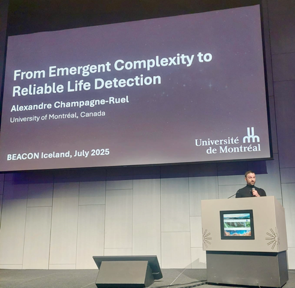

Alexandre Champagne-Ruel, a PhD student in physics at the University of Montreal, has been awarded a prestigious grant from NASA's postdoctoral programme in astrobiology. This will enable him to continue his research on detecting life in the Universe at Arizona State University for the next two years.
<!--more-->

His research project examines how the physical structure of an environment, such as on other planets or asteroids, can lead to a complexification of the chemistry taking place there. By drawing on a recent theory known as the ‘assembly theory,’ which postulates that only life can generate complex molecules in significant quantities, this work aims to inform and advance our efforts to detect life elsewhere in the universe.

Preliminary results from this research were presented last July at the Biennial European Astrobiology Conference in Reykjavík, Iceland. An article based on Alexandre's work is also about to be submitted for publication in a scientific journal. The doctoral student was also recently invited to the renowned Santa Fe Institute in New Mexico to participate in a seminar on the application of assembly theory to the field of proteins.

Holder of two bachelor’s degrees, in Physics and in Philosophy, as well as a master’s degree in Physics, Alexandre submitted his doctoral dissertation just a few weeks ago. His PhD studies in Physics were funded in part by the Fonds de recherche du Québec and the J. Armand Bombardier Foundation. He will begin his new research at Arizona State University this fall.

**About the Centre for Research in Astrophysics of Quebec**

The Centre for Research in Astrophysics of Quebec brings together all the astrophysicists in Quebec. Nearly 150 people, including some fifty researchers and their students from Université de Montréal, McGill University, Université Laval, Bishop’s University, Cégep de Sherbrooke, Collège de Bois-de-Boulogne and a number of other collaborating institutions are part of the cluster. The Center is under the direction of David Lafrenière of the Université de Montréal. The Center is one of the strategic clusters funded by the Fonds de recherche du Québec – Nature and Technologies (FRQNT).

**Source and information**

Frédérique Baron, Media Relations

Centre for Research in Astrophysics of Quebec

frederique.baron@umontreal.ca