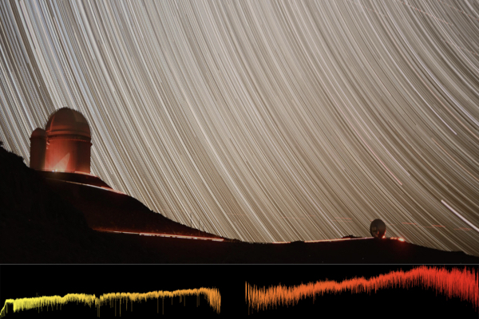
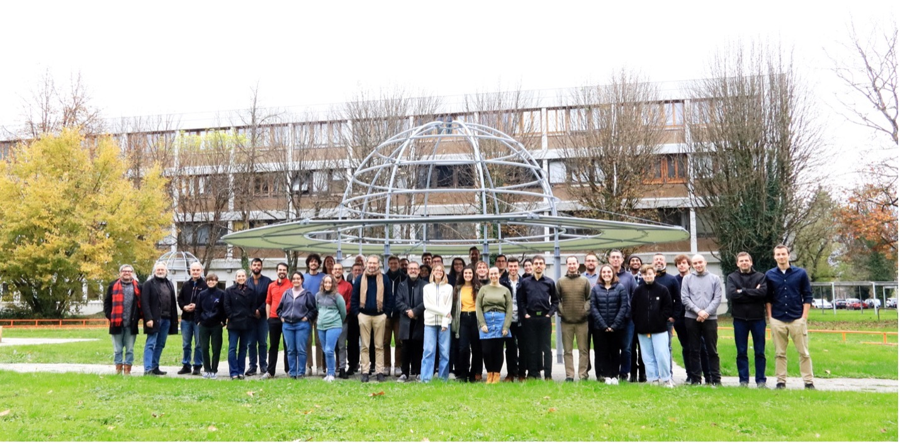

The Near-InfraRed Planet Searcher (NIRPS) is a new high-resolution spectrograph designed to search for exoplanets and study their atmospheres. Exoplanets are planets orbiting stars other than our Sun. In a new study published today in Astronomy & Astrophysics, the international NIRPS team shares the instrument’s design, first observations, and early scientific results.

<!--more-->

Located at the 3.6-metre telescope of La Silla Observatory in Chile, NIRPS officially began its scientific mission in April 2023. Its development and construction were achieved thanks to the work of a large consortium bringing together scientists and engineers from Canada, Switzerland, Spain, Portugal, France, and Brazil, with valuable support from the European Southern Observatory (ESO). More than 140 experts contributed to the project, including a large team from the Observatoire du Mont-Mégantic (OMM) and the Trottier Institute for Research on Exoplanets (IREx).

NIRPS is specially designed to observe in the near-infrared wavelengths, where cool, red stars known as M dwarfs, by far the most common stars in the galaxy, shine the brightest. This makes NIRPS ideally suited to detect small, Earth-like planets orbiting these stars.  NIRPS is also particularly well suited for detecting and studying exoplanet atmospheres. The instrument was designed to work in tandem with another powerful planet-hunting instrument: High Accuracy Radial velocity Planet Searcher (HARPS), a visible-light spectrograph that has been operating on the same telescope since 2003. Together, NIRPS and HARPS provide a rare ability to observe stars in both visible and infrared light at the same time.  This dual capability helps scientists separate true planetary signals from the "noise" caused by stellar activity, such as flares, spots or magnetic activity on the star’s surface, which can sometimes mimic the presence of a planet. 

In addition, NIRPS features an adaptive optics system, which sharpens images by correcting for distortions caused by Earth's atmosphere. This feature allows the instrument to collect starlight more efficiently while maintaining a compact design.

“This instrument is the result of lessons learned from previous spectrographs, innovative new technologies, and fruitful international collaboration,” says François Bouchy from Observatoire de Genève and professor at Université de Genève, lead author of the study and co-principal investigator of NIRPS. “We’re proud of what we’ve achieved and excited about what lies ahead.”

**Unveiling exoplanets with NIRPS**

Both HARPS and NIRPS detect exoplanets by using a technique known as the radial velocity method, which measures the minute wobble of a star caused by the gravitational tug of an orbiting planet. As a planet orbits, it causes its host star to move slightly back and forth. By measuring these subtle changes in the star’s velocity, astronomers can infer the presence of a planet, even if they can’t see the planet directly. Detecting a small, Earth-mass exoplanet orbiting a small M dwarf is challenging. It requires the ability to measure changes in a star’s velocity as small as one metre per second or 3,6 km/h. Achieving this level of precision is already difficult in visible light, and even more so in the near-infrared, where NIRPS operates. In addition to detecting planets, NIRPS is also well suited for studying their atmospheres. Its infrared sensitivity allows astronomers to detect key chemical signatures such as water vapor, helium and methane.
“NIRPS allows us to study stars and planets in a part of the spectrum where no other has achieved this level of precision,” says René Doyon, Director of the OMM and the IREx, professor at Université de Montréal and co-principal investigator of NIRPS. “For the first time, we can reach sub-meter-per-second radial velocity precision in the infrared, comparable to that of the best visible-light spectrographs.”
In exchange for building the instrument, the NIRPS consortium was granted by ESO 725 nights of Guaranteed Time Observation (GTO) with NIRPS. This observing time is being used by the NIRPS Science Team, composed of members from the international consortium, to pursue three main objectives: to search for exoplanets around M dwarfs, to measure the masses of transiting exoplanets, detected by space surveys, and to study the atmospheres of a variety of exoplanets. 

“As part of the GTO, we have 40% of the time of the 3.6-metre telescope, which means we’re receiving new data almost every day! says Lison Malo, NIRPS project manager at the OMM and the IREx. “This allows a large team of astronomers to work continuously with new observations from NIRPS.”

**First Results from NIRPS**

NIRPS a démontré sa puissance scientifique dès ses premiers mois d’opération. Une équipe menée par Alejandro Suárez Mascareño de l’Instituto de Astrofísica de Canarias et de l’Université de La Laguna, Espagne) a confirmé la présence de Proxima Centauri b, une planète semblable à la Terre située dans la zone habitable de notre étoile la plus proche. L’équipe a également trouvé des indices d’une seconde planètNIRPS wasted no time in proving its scientific power. In its first months of operation, a work led by Alejandro Suárez Mascareño of the Instituto de Astrofísica de Canarias and the Universidad de La Laguna (ULL) in Spain confirmed the presence of Proxima Centauri b, an Earth-like planet in the habitable zone of Proxima Centauri, the closest star to the Sun. They also found evidence of the presence of a second planet, less massive than Earth, orbiting the star. These findings highlight NIRPS’s exceptional sensitivity to low-mass planets. The findings are detailed in a study published today in Astronomy & Astrophysics.
A separate study, also published today in Astronomy & Astrophysics and led by Romain Allart from the IREx at Université de Montréal, reveals a comet-like tail of escaping helium gas from the atmosphere of WASP-69 b, a Saturn-mass exoplanet. The observation, among the most detailed of its kind, sheds new light on how planetary atmospheres evolve under intense stellar radiation.
“The high-quality and high-fidelity data from NIRPS allows us to study exoplanet atmospheres in more detail than ever before”, says Romain Allart, lead author of the study on WASP-69b. “With the NIRPS’s GTO, we are be able to follow-up stars and their planets on a long-time scale to study the variability of their climate.”

**Looking Ahead**

NIRPS will play an important role in identifying the most promising targets for atmospheric follow-up with the James Webb Space Telescope and, in the future, for biosignature searches with the upcoming European Extremely Large Telescope (ELT), which is currently under construction.
NIRPS also plays a crucial role as a pathfinder for the development of ArmazoNes high Dispersion Echelle Spectrograph (ANDES), a second-generation instrument currently being developed for the ELT. One of NIRPS’s scientific goals is to study the closest stars to the Sun and uncover planetary systems that could be ideal targets for ANDES. In many ways, NIRPS serves as a prototype for ANDES, as both instruments feature high-resolution near-infrared spectroscopy combined with adaptive optics, capabilities that are essential for probing the atmospheres of Earth-like planets for signs of life.

**About these studies**

“NIRPS joining HARPS at the ESO 3.6m : On-sky performance and science objectives”, led by François Bouchy from the Observatoire de Genève at Université de Genève, has been published today in Astronomy & Astrophysics. The team also include 32 co-authors from Université de Montréal’s Trottier Institute for Research on Exoplanets and the Observatoire du Mont-Mégantic, and 109 other co-authors from Brazil, Canada, Chile, France, Germany, Portugal, Spain, and Switzerland
“Diving into the planetary system of Proxima with NIRPS : Breaking the metre per second barrier in the infrared” by Alejandro Suárez Mascareño, has been published today in Astronomy & Astrophysics. The team also include 37 from Université de Montréal’s Trottier Institute for Research on Exoplanets and the Observatoire du Mont-Mégantic; and 101 other co-authors from Brazil, Canada, Chile, France, Germany, Portugal, Spain, and Switzerland.
“NIRPS detection of delayed atmospheric escape from the warm and misaligned Saturn-mass exoplanet WASP-69 b?” , led by Romain Allart from the IREx, has been published today in Astronomy & Astrophysics. The team also include 26 from Université de Montréal’s Trottier Institute for Research on Exoplanets and the Observatoire du Mont-Mégantic; and 113 other co-authors from Brazil, Canada, Chile, France, Germany, Portugal, Spain, and Switzerland.

**Media contact**

Frédérique Baron 
Centre for Research in Astrophysics of Quebec 
Université de Montréal 
frederique.baron@umontreal.ca 
 
**Scientific contacts**
René Doyon 
Researcher 
Centre for Research in Astrophysics of Quebec 
Université de Montréal 
rene.doyon@umontreal.ca

Lison Malo 
Researcher 
Centre for Research in Astrophysics of Quebec 
Université de Montréal 
lison.malo@umontreal.ca

Romain Allart 
Researcher 
Centre for Research in Astrophysics of Quebec 
Université de Montréal 
romain.allart@umontreal.ca 
+1 438 345 9086

