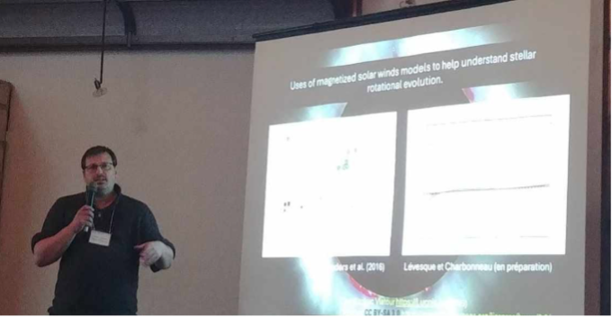
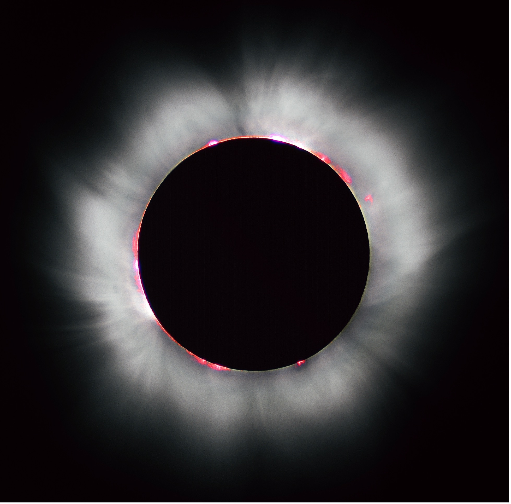
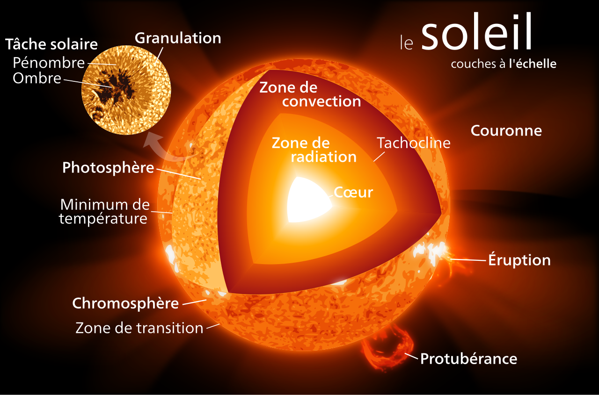

**La rotation des étoiles est depuis longtemps utilisée comme une horloge cosmique.** En mesurant la vitesse de rotation d’une étoile semblable au Soleil, les astronomes pouvaient estimer son âge avec une précision remarquable. Mais depuis une dizaine d’années, cette méthode, appelée *gyrochronologie*, montre des signes de faiblesse chez les étoiles un peu plus âgées que le Soleil. Pourquoi tournent-elles encore trop vite, alors qu’elles devraient avoir ralenti?

Michaël Lévesque s’intéresse à cette énigme. Il est étudiant au doctorat, sous la supervision de Paul Charbonneau à l’Université de Montréal et membre du Centre de recherche en astrophysique du Québec. Il est aussi le premier auteur de l’étude *Breaking gyrochronology through the collapse of coronal winds*, réalisée en collaboration avec Paul Charbonneau.

**Question : Pouvez-vous nous expliquer simplement ce qu’est la gyrochronologie ?**

La gyrochronologie est une méthode dite empirique, qui relie la vitesse de rotation d’une étoile et son âge des étoiles.

Les étoiles ont, comme le Soleil, un vent stellaire, composé d’un flux de particules chargées qui s’échappe de la couronne de l’étoile. Si vous avez eu la chance de voir l’éclipse solaire totale du 8 avril 2024, vous avez sans doute remarqué, durant la phase de totalité, l’apparition d’une aura blanche qui irradie du Soleil tel des cheveux irradient d’une tête. Cette structure est la couronne du Soleil et elle constitue la base du vent solaire. Par plusieurs processus de chauffage, ce gaz magnétisé se disperse dans l’espace. Les vents stellaires sont l’équivalent des vents solaire pour d’autres étoiles que le Soleil.

Ce vent est magnétisé, c’est-à-dire, qu’ils peuvent être dévié par des champ magnétiques. Comme les étoiles ont des champs magnétiques, elles exercent une force sur leur vent, qui lui-même exerce en réaction une force sur l’étoile, qui agit comme un genre de frein. C’est pourquoi les étoiles tournent moins vite sur elles-mêmes avec le temps. Pour le Soleil, ce mécanisme est bien compris et fonctionne depuis des milliards d’années.

**Question : Et pourtant, quelque chose ne fonctionne plus?**

En effet! Des observations récentes menée par l’équipe de Jennifer van Saders ont montré que des étoiles plus vieilles que le Soleil de quelques milliards d’année tournent plus rapidement que ce qui est prescrit par la gyrochronologie. Ceci implique que les étoile n’ont pas été freiné aussi efficacement que prévu.

Par ses récents échecs, la gyrochronologie classique a permis de mettre à jours des lacunes dans notre compréhension de la physique du freinage magnétique des étoiles de masses similaires au Soleil. Il était donc nécessaire de créer une nouvelle méthode de gyrochronologie basé sur des modèles physiques pouvant permettre d’ajouter une méthode de caractérisation de l’âge des étoiles et de mieux comprendre l’évolution de la rotation des étoiles.

**Question : Votre étude explore une nouvelle hypothèse : que les vents stellaires s’effondrent quand les étoiles vieillissent. Pourquoi?**

Dans le contexte d’évolution de la rotation des étoiles, on évoque souvent un changement brutal dans le régime dynamo, un mécanisme avec lequel les étoiles génèrent leur champ magnétique à l’aide de leur rotation.  C’est comme si le moteur magnétique de l’étoile s’affaiblissait soudainement. Le problème est que cette idée ne permet de rendre compte des observations qu’en introduisant des ruptures artificielles dans les modèles. Nous avons plutôt exploré une autre possibilité: et si ce n’était pas le champ magnétique qui changeait radicalement, mais plutôt le vent lui-même qui s’effondrait?

Notre objectif est de créer un modèle d’évolution de la rotation réaliste qui est basé autant que possible sur des principes fondamentaux de la physique plutôt que sur des relations mathématiques basées sur des observations. Nous avons adapté un modèle de vent magnétisé formulé par Eugene Weber et Leverett Davis en 1967 pour le Soleil afin de l’utiliser pour des étoiles en général. Ce modèle reste assez simple numériquement. Cette démarche nous a permis de vérifier une hypothèse différente pour expliquer les observations de l’équipe de Jennifer van Saders : et si un changement des propriétés du vent stellaire était responsable de la diminution de l’efficacité du freinage magnétique?

**Question : Que se passe-t-il alors?**

Si la couronne de l’étoile reçoit moins d’énergie, elle se refroidit. Or, nos modèles montrent qu’en dessous d’une certaine température critique, le vent devient beaucoup moins efficace. Il transporte alors beaucoup moins de matière… et surtout beaucoup moins de moment angulaire. Résultat: l’étoile cesse pratiquement de ralentir. Ceci implique que les modèles d’évolution de la rotation des étoiles peuvent devenir des outils d’études des processus de chauffage de la couronne, dont le mécanisme est encore inconnu.

**Question : Vous avez montré que cette explication ne tient pas complètement. Qu’est-ce que cela veut dire concrètement ?**

En fait, on a peut-être trouvé un élément du casse-tête, mais le nœud du problème reste présent. On a montré qu’il est possible de diverger de la gyrochronologie en utilisant nos modèles, mais pas assez pour expliquer les observations. La prochaine étape sera d’étudier l’efficacité réduite du chauffage de la couronne afin d’expliquer les observations. Si cela n’explique toujours pas les observations, cela signifie qu’un changement de régime dynamo doit faire partie de l’explication.

**Question : Qu’est-ce que cela change pour notre compréhension du Soleil et de son futur ?**

C’est une bonne question et la réponse dépends de nos résultats futurs. Si nos recherches pointent dans la direction d’un effondrement du vent solaire, un vent solaire moins fort entrainera une diminution de l’érosion des atmosphères des planètes du système solaire tel que la Terre. Si nos résultats futurs pointent plutôt vers un changement de régime dynamo, ça implique que l’activité magnétique du Soleil diminuera grandement dans les prochaines centaines de millions d’années ce qui entraînera potentiellement une diminution des éruptions solaires.Écris ici un court résumé qui apparaîtra sur la page des nouvelles.

**À propos du Centre de recherche en astrophysique du Québec**

Le Centre de recherche en astrophysique du Québec regroupe tous les astrophysiciens du Québec. Près de 150 personnes, dont une cinquantaine de chercheurs et leurs étudiants provenant de l’Université de Montréal, de McGill University, de l’Université Laval, de Bishop’s University, du Cégep de Sherbrooke, du Collège de Bois-de-Boulogne et de quelques autres établissements collaborateurs font partie du regroupement. Le Centre est sous la direction de David Lafrenière de l’Université de Montréal et il est un des regroupements stratégiques financés par Le Fonds de recherche du Québec – Nature et technologies (FRQNT).

**Source et renseignements**

Frédérique Baron, responsable des relations avec les médias

Centre de recherche en astrophysique du Québec

frederique.baron@umontreal.ca

